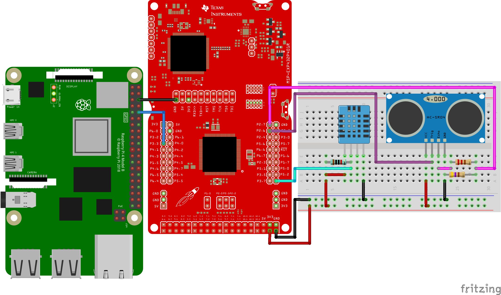
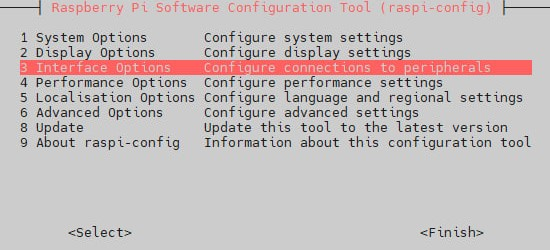
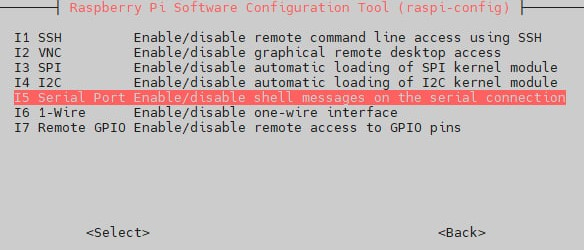
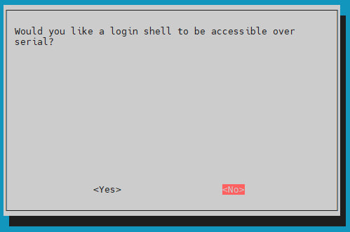
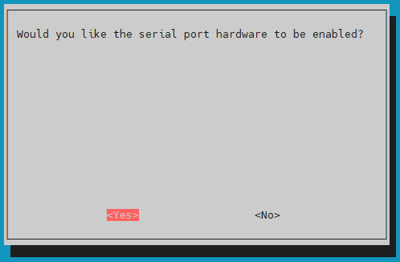

# Smart Fridge Project - Embedded systems and IoT

Welcome to the Smart Fridge project repository! This project involves the creation of a smart refrigerator that can recognize objects inside it using a camera, check temperature and humidity using some sensors and display the results on a dedicated website.

The project is developed by a team of three students of the University of Trento, in the context of the course of Embedded Systems and IoT.

## Index:
- [Key Features](#key-features)
- [System Requirements](#system-requirements)
- [Project Layout](#project-layout)
- [Raspberry PI 4 - Initial Configuration](#raspberry-pi-4---initial-configuration)
  - [Install Raspbian OS](#install-raspbian-os)
  - [Install NVM](#install-nvm)
  - [Install Docker Engine on Debian](#install-docker-engine-on-debian)
  - [Install Portainer in Docker](#install-portainer-in-docker)
  - [Install MongoDB in Docker](#install-mongodb-in-docker)
  - [Install PIP (if not installed)](#install-pip-if-not-installed)
  - [Install libraries for AI](#install-libraries-for-ai)
  - [Pull the GitHub project folder and install the packages for the backend](#pull-the-github-project-folder-and-install-the-packages-for-the-backend)
  - [Run the project](#run-the-project)
- [Basic Implementation](#basic-implementation)
  - [MSP432](#msp432)
  - [AI Algorithm](#ai-algorithm)
  - [Node](#node)
- [Links](#links)
- [Team Members](#team-members) 

## Key Features

- **Object Recognition**: A camera integrated into the fridge captures images of objects inside
- **Image Analysis**: A YOLO algorithm processes the images to identify the objects present in the fridge
- **Sensor Management**: The MSP432 is used to control DHT11 and HC-SR04 sensors and transmit the data to the Raspberry via UART 
- **Online Visualization**: The inventory of recognized products, the desired products and the missing products are displayed on a website hosted on the RaspberryPi

## System Requirements
- [Raspberry Pi 4](https://www.raspberrypi.com/products/raspberry-pi-4-model-b) with an Internet connection
- [Wide PiCamera](https://www.amazon.it/Electreeks%C2%AE-fotocamera-Raspberry-automatico-infrarossi/dp/B08C5GDG9Q/ref=sr_1_3?__mk_it_IT=%C3%85M%C3%85%C5%BD%C3%95%C3%91&crid=1OSHCC7VZJCZ5&keywords=wide%2Bpi%2Bcamera&qid=1706637122&sprefix=wide%2Bpi%2Bcamera%2Caps%2C440&sr=8-3&th=1) with Raspberry Pi
- Humidity and Temperature Sensor [DHT11](https://www.adafruit.com/product/386)
- Ultrasonic Sensor [HC-SR04](https://www.adafruit.com/product/3942)
- Resistors:
  - 10 kΩ
  - 220 Ω
  - 470 Ω
- [Python 3.11](#install-pip-if-not-installed)
- [Node v20](#install-nvm)
- Texas Instruments MSP432 board (optional)



## Project Layout
```
├── README.md
├── MSP432
│   └── MSP_Sensors
│       └── MSP_Sensors.ino
└── backend
    ├── backend@1.0.0
    ├── image.jpg
    ├── index.js
    ├── nodemon
    ├── package.json
    ├── package-lock.json
    ├── yolov8m.pt
    ├── AI
    │   └── imageRecognition.py
    ├── app
    │   ├── app.js
    │   ├── product.js
    │   ├── sensor.js
    │   ├── wishlist.js
    │   └── models
    │       ├── product.js
    │       └── sensor.js
    └── static
        ├── index.css
        ├── index.html
        └── index.js

```

## MSP432 - Initial Configuration

The [Energia IDE](https://energia.nu/) has been used to develop the code for the MSP432 board. The project to flash the board is available in the git repository in the `MSP432` folder.


## Raspberry PI 4 - Initial Configuration
The main steps for the initial configuration are:
- [Install Raspbian OS](#install-raspbian-os)
- [Install NVM](#install-nvm)
- [Install Docker Engine](#install-docker-engine-on-debian)
- [Install Portainer in Docker](#install-portainer-in-docker)
- [Install MongoDB in Docker](#install-mongodb-in-docker)
- [Pull the GitHub project folder](#pull-the-github-project-folder)
- [(Optional) Enable the serial port](#optional--enable-the-serial-port)
- [Install PIP](#install-pip-if-not-installed)
- [Install libraries for AI](#install-libraries-for-ai)
- [Pull the project and install the packages](#pull-the-github-project-folder-and-install-the-packages-for-the-backend)
- [Run the project](#run-the-project)

### Install Raspbian OS
The first step is to install the Raspbian OS on the Raspberry. \
The recommended version is the [Raspberry Pi OS Lite](https://www.raspberrypi.com/software/operating-systems/), a minimal image based on Debian Buster.
The image can be downloaded and flashed on a microSD card directly using the [Raspberry Pi Imager](https://www.raspberrypi.com/software/).
> [!IMPORTANT]
> The Raspberry Pi name needs to be set to `raspberrypi` to match the configuration used in the backend.

### Install NVM
Node Version Manager is a tool designed for managing multiple installations of Node.js on a single system. \
It allows developers to easily switch between different versions of Node.js and provides a command-line interface to install, switch, and manage Node.js versions with ease.

The first step to initialize the Raspberry is to install NVM, the Node Version Manager:
```bash
sudo apt update
sudo apt upgrade

curl -o- https://raw.githubusercontent.com/nvm-sh/nvm/v0.39.1/install.sh | bash
source ~/.bashrc

nvm install 20
```

### Install Docker Engine on Debian
Docker is used to run the backend of the project. It allows to run the MongoDB database in a containerized environment. 
The first step is to install Docker Engine on Debian.

Add Docker's official GPG key: 
```bash
sudo apt update
sudo apt install ca-certificates curl gnupg
sudo install -m 0755 -d /etc/apt/keyrings
curl -fsSL https://download.docker.com/linux/debian/gpg | sudo gpg --dearmor -o /etc/apt/keyrings/docker.gpg
sudo chmod a+r /etc/apt/keyrings/docker.gpg
```

Add the repository to Apt sources:
```bash
echo \
  "deb [arch=$(dpkg --print-architecture) signed-by=/etc/apt/keyrings/docker.gpg] \
  https://download.docker.com/linux/debian \
  $(. /etc/os-release && echo "$VERSION_CODENAME") stable" | \
  sudo tee /etc/apt/sources.list.d/docker.list > /dev/null

sudo apt update

sudo apt install docker-ce docker-ce-cli containerd.io docker-buildx-plugin docker-compose-plugin
```

### Install Portainer in Docker

Portainer is a lightweight management UI that allows the user to easily manage Docker environments. Its primary purpose is to provide a user-friendly interface for Docker container orchestration and management.
>[!NOTE]
>This component is not required for the project, but it can be useful to monitor the status of the containers.

```bash
sudo docker pull portainer/portainer-ce:latest

sudo docker run -d -p 9000:9000 --name=portainer --restart=always \
    -v /var/run/docker.sock:/var/run/docker.sock \
    -v portainer_data:/data portainer/portainer-ce:latest
```

### Install MongoDB in Docker
MongoDB is a document-oriented database program. It uses JSON-like documents with optional schemas. In this project, it is used to store the data collected by the sensors and the images captured by the camera.

The database is installed in a Docker container and it is accessible from the Raspberry and from the MSP432 board at port 27017.
```bash
sudo docker run -d -p 27017:27017 -- restart=always \
    -v ~/data:/data/db --name mongo mongo:bionic
```

### ( Optional ) Enable the serial port
>[!NOTE]
>This part is NOT NECESSARY if you want to attach the sensors directly to the Raspberry \
>NOT IMPLEMENTED IN THIS PROJECT

The serial port needs to be enabled using the raspi-config tool:
```bash
sudo raspi-config
```
Select the third menu (3 Interface Options)\


Select the fifth interface (I5 Serial Port)\


In the first window (Login using Serial) select the option `No`:\


In the second window (Serial port hardware) select the option `Yes`:\


> [!IMPORTANT]
> Then you need to reboot the Raspberry PI

### Install PIP (if not installed)
PIP is the package installer for Python. It allows to install and manage additional libraries.
```bash
sudo apt install python3-pip

sudo mv /usr/lib/python3.11/EXTERNALLY-MANAGED /usr/lib/python3.11/EXTERNALLY-MANAGED.old
```

### Install libraries for AI
The following libraries are required to run the AI algorithm:
```bash
sudo apt install libgl1-mesa-glx libcap-dev

pip install ultralytics pymongo

sudo apt install -y python3-libcamera python3-kms++
sudo apt install -y python3-pyqt5 python3-prctl libatlas-base-dev ffmpeg
pip3 install numpy --upgrade
pip3 install picamera2[gui]

PATH=$PATH:/home/pi/.local/bin
``` 

### Pull the GitHub project folder and install the packages for the backend
Download the project folder from [GitHub](https://github.com/ELI20ZIVI/IoT-Fridge):
```bash
git pull https://github.com/ELI20ZIVI/IoT-Fridge
cd backend
npm install
```

### Run the project
To run the project, you need to run the following command in the `backend` folder:

```
npm run dev
```

## Basic Implementation

### MSP432

The MSP432 board is used to control the DHT11 and HC-SR04 sensors and to send the data to the Raspberry Pi via UART. The following code is a part of the code used to control these sensors and to send the data to the Raspberry Pi:

```python
...

void loop() {
  sensors_event_t event;

  // Read temperature value
  dht.temperature().getEvent(&event);

  // If the temperature value is not a number
  if (isnan(event.temperature)) {
    Serial1.print("{ \"type\" : \"temperature\", \"value\" : ");
    Serial1.print("undefined");
    Serial1.println(" }");
    Serial1.println('\0');
  }
  // Otherwise, print the temperature value
  else {
    Serial1.print("{ \"type\" : \"temperature\", \"value\" : ");
    Serial1.print(event.temperature);
    Serial1.println(" }");
    Serial1.println('\0');
  }

...
```

### AI Algorithm
The AI algorithm is used to recognize the objects inside the fridge. The following code is a part of the code used to recognize the objects and to store the data in the database:

```python
...

for class_name, count in class_count.items():
        existing_document = collection.find_one({"name": class_name})

        if existing_document:
            # Update the quantity if the object exists
            collection.update_one({"name": class_name}, {"$set": {"quantity": count}})

        # Rimuovere quando si aggiungono tutte le classi al database
        else:
            # Insert the object if it doesn't exist
            data_to_insert = {
                "name": class_name,
                "quantity": count,
                "wishList": False,
                "desiredQuantity": 0
            }
            print(data_to_insert)
            result = collection.insert_one(data_to_insert)
...
```

### Node 
Node is in charge of the backend and the communication with the database. The backend is used to manage the data collected by the sensors and the products recognised by the AI. It also provides APIs to interact with the database and to retrieve the data from the frontend. \
The following code shows how the backend listens for data events from the serial port and how it spawns the Python script as a child process:

```javascript
...

// Listen for data events from the serial port
serial.on("data", (data) => {
  receivedData += data.toString("utf-8");

  // Check if the received data contains the end of the message
  if (receivedData.includes("\0")) {
    console.log("Received complete data: " + receivedData);
    saveData(receivedData);     // Save data on DB
    receivedData = "";          // Clear the buffer
  }
});

...

// Spawn the Python script as a child process
const pythonScript = "AI/imageRecognition.py";
const pythonProcess = spawn("python", [pythonScript]);

// Listen for output events from the Python script
pythonProcess.stdout.on("data", (data) => {
  console.log("Python script output:" + data);
});

...
```
The following table shows the main API available in the backend:
| TYPE | API | PARAMETERS | DESCRIPTION |
|--|--|--|--|
| GET | `/products/all` | --- | Retrive all product ever been in the fridge |
| GET | `/product/status` | --- | Retrive all prduct that are actually in the fridge |
| GET | `/sensor/all` | --- | Retrive all sensor data |
| GET | `/wishlist/missing` | --- | Retrive all the prducts that are in the wishlist and not in the fridge |
| PUT | `/wishlist/addProduct` | `name: string, quantity: int` | Add a product to the wishlist and the desired quantity |
| PUT | `/wishlist/removeProduct` | `name: string` | Remove a product from the wishlist |

## Links
- [Project Video]()
- [Project Presentation]()

## Team Members
In the context of this project all the team members have collaborated to the development of the project and helped each other in the different tasks.
The entire team has worked together to design the project and to define the main features. It also worked together to develop the initial configuration of the RaspberryPi.

However, each member focused on a a specific part of the project.
The following list shows the main responsibilities of each member:
- [Elia Ziviani](https://github.com/ELI20ZIVI) is responsible for the algorithm and training of the AI model
- [Lorenzo Fasol](https://github.com/Lory1403) is responsible for the frontend and the development of the circuits and software of the MSP432 board mounting the sensors
- [Riccardo Minella](https://github.com/riccardominella) is responsible for the development of the backend and the integration of the AI model
